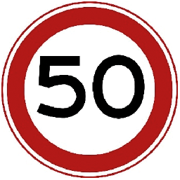
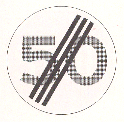
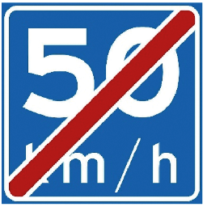
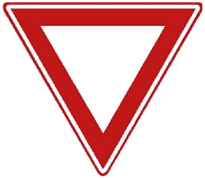
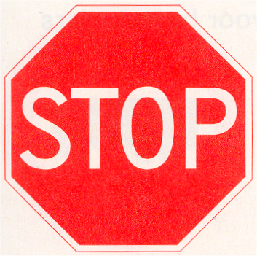
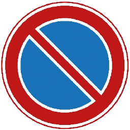
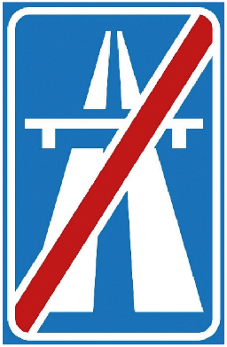
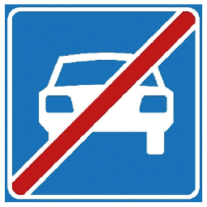
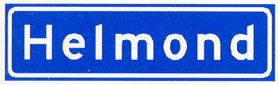

# Reglement verkeersregels en verkeerstekens 1990 (RVV 1990)

## Hoofdstuk I Begripsbepalingen

#### Artikel 1 RVV 1990 [Begripsbepaling]

In dit besluit en de daarop berustende bepalingen wordt verstaan onder:

- aanhangwagens: voertuigen die door een voertuig worden voortbewogen of kennelijk bestemd zijn om aldus te worden voortbewogen, alsmede opleggers;
- autobus: motorvoertuig, ingericht voor het vervoer van meer dan acht personen, de bestuurder daaronder niet begrepen;
- autosnelweg: weg, aangeduid door bord G1 van [bijlage I](#bijlage-1-rvv-1990-verkeersborden); langs autosnelwegen gelegen parkeerplaatsen, tankstations en bushalteplaatsen maken geen deel van de autosnelweg uit;
- autoweg: weg, aangeduid door bord G3 van [bijlage I](#bijlage-1-rvv-1990-verkeersborden); langs autowegen gelegen parkeerplaatsen, tankstations en bushalteplaatsen maken geen deel van de autoweg uit;
- bedrijfsauto: bedrijfsauto als bedoeld in artikel 1.1 van de Regeling voertuigen;
- bestelauto: motorvoertuig, bestemd voor het vervoer van goederen, waarvan de toegestane maximum massa niet meer bedraagt dan 3500 kg;
- bestemmingsverkeer: bestuurders wier reisdoel één of meer bepaalde percelen betreft die zijn gelegen aan of in de directe nabijheid van een weg met een door verkeerstekens aangegeven geslotenverklaring voor bepaalde categorieën bestuurders en die slechts via deze weg zijn te bereiken alsmede bestuurders van lijnbussen;
- bestuurders: alle weggebruikers behalve voetgangers;
- bestuurder van een motorvoertuig: hij die het motorvoertuig bestuurt;
- doorgaande rijbaan: rijbaan zonder de invoeg- en uitrijstroken;
- fietsstrook: door doorgetrokken of onderbroken strepen gemarkeerd gedeelte van de rijbaan waarop afbeeldingen van een fiets zijn aangebracht;
- geslotenverklaring: verbod de betrokken weg in te rijden of in te gaan alsmede de betrokken weg te gebruiken;
- haaientanden: voorrangsdriehoeken op het wegdek;
- kruispunt: kruising of splitsing van wegen;
- motorfiets: motorvoertuig op twee wielen al dan niet met zijspan- of aanhangwagen;
- personenauto: personenauto als bedoeld in artikel 1.1 van de Regeling voertuigen;
- rijbaan: elk voor rijdende voertuigen bestemd weggedeelte met uitzondering van de fietspaden en de fiets/bromfietspaden;
- rijstrook: door doorgetrokken of onderbroken strepen gemarkeerd gedeelte van de rijbaan van zodanige breedte dat bestuurders van motorvoertuigen op meer dan twee wielen daarvan gebruik kunnen maken;

## Hoofdstuk II Verkeersregels

### § 1 Plaats op de weg

#### Artikel 3 RVV 1990 [Rechts houden]

1. Bestuurders zijn verplicht zoveel mogelijk rechts te houden.
2. Fietsers mogen met zijn tweeën naast elkaar rijden. Dit geldt niet voor snorfietsers.

#### Artikel 4 RVV 1990 [Voetgangers]

1. Voetgangers gebruiken het trottoir of het voetpad.
2. Zij gebruiken het fietspad of het fiets/bromfietspad indien trottoir en voetpad ontbreken.
3. Zij gebruiken de berm of de uiterste zijde van de rijbaan, indien ook een fietspad of een fiets/bromfietspad ontbreekt.
4. In afwijking van het eerste en het tweede lid gebruiken personen die zich verplaatsen met behulp van voorwerpen, niet zijnde voertuigen, het fietspad, het fiets/bromfietspad, het trottoir of het voetpad. Zij gebruiken de rijbaan indien een fietspad, een fiets/bromfietspad, een trottoir of een voetpad ontbreekt.

#### Artikel 5 RVV 1990 [Fietsers]

1. Fietsers gebruiken het verplichte fietspad of het fiets/bromfietspad.
2. Zij gebruiken de rijbaan indien een verplicht fietspad of een fiets/bromfietspad ontbreekt.
3. Zij mogen het onverplichte fietspad gebruiken. Bestuurders van snorfietsen uitgerust met een verbrandingsmotor mogen het onverplichte fietspad slechts gebruiken met uitgeschakelde motor.
4. Bestuurders van fietsen op meer dan twee wielen die met inbegrip van de lading breder zijn dan 0,75 meter en van fietsen met aanhangwagen die met inbegrip van de lading breder zijn dan 0,75 meter mogen de rijbaan gebruiken.

#### Artikel 6 RVV 1990 [Bromfietsers]

1. Bromfietsers gebruiken het fiets/bromfietspad.
2. Zij gebruiken de rijbaan indien een fiets/bromfietspad ontbreekt.
3. Bestuurders van bromfietsen op meer dan twee wielen en bromfietsen met aanhangwagen, die met inbegrip van de lading breder zijn dan 0,75 meter, gebruiken de rijbaan.

### § 2 Inhalen

#### Artikel 11 RVV 1990 [Wijze van inhalen]

1. Inhalen geschiedt links.
2. Bestuurders die links voorgesorteerd hebben en te kennen hebben gegeven dat zij naar links willen afslaan, worden rechts ingehaald.
3. Fietsers dienen elkaar links in te halen; zij mogen andere bestuurders rechts inhalen.
4. Bestuurders die zich rechts van een blokmarkering bevinden mogen bestuurders die zich links van deze markering bevinden rechts inhalen.
5. Bestuurders mogen trams rechts inhalen.

#### Artikel 12 RVV 1990 [Verbod inhalen voor voetgangersoversteekplaats]

Het is verboden een voertuig vlak voor of op een voetgangersoversteekplaats in te halen.

### § 3 Files

#### Artikel 13 RVV 1990 [Plaats op de weg bij fileverkeer]

1. Bij fileverkeer behoeft, indien de rijbaan is verdeeld in rijstroken in dezelfde richting, niet de meest rechts gelegen rijstrook te worden gevolgd.
2. Files mogen aan de rechterzijde worden ingehaald.

### § 4 Oprijden van kruispunten

#### Artikel 14 RVV 1990 [Verbod blokkeren kruispunt]

Bestuurders mogen een kruispunt niet blokkeren.

### § 5 Verlenen van voorrang

#### Artikel 15 RVV 1990 [Voorrang]

1. Op kruispunten verlenen bestuurders voorrang aan voor hen van rechts komende bestuurders.
2. Op deze regel gelden de volgende uitzonderingen:
    1. bestuurders op een onverharde weg verlenen voorrang aan bestuurders op een verharde weg;
    2. bestuurders verlenen voorrang aan bestuurders van een tram.

### § 5a Gedrag bij overwegen

#### Artikel 15a RVV 1990 [Gebruik overweg]

1. Weggebruikers mogen een overweg opgaan, indien zij direct kunnen doorgaan en de overweg geheel kunnen vrijmaken.
2. Bij overwegen laten weggebruikers een spoorvoertuig voorgaan en laten daarbij de overweg geheel vrij.

### § 6 Doorsnijden militaire colonnes en uitvaartstoeten van motorvoertuigen

#### Artikel 16 RVV 1990 [Verbod doorsnijden militaire colonnes]

Weggebruikers mogen militaire colonnes en uitvaartstoeten van motorvoertuigen niet doorsnijden.

### § 7 Afslaan

#### Artikel 17 RVV 1990 [Afslaan. Voorsorteren]

1. Bestuurders die willen afslaan, mogen voorsorteren door:
    1. indien zij naar rechts willen afslaan tijdig zoveel mogelijk aan de rechterzijde te gaan rijden;
    2. indien zij naar links willen afslaan tijdig zoveel mogelijk tegen de wegas te rijden of bij rijbanen bestemd voor bestuurders in één richting daarop zoveel mogelijk links te houden.
2. Bestuurders moeten alvorens af te slaan een teken met hun richtingaanwijzer of met hun arm geven.

#### Artikel 18 RVV 1990 [Voorrang bij afslaan]

1. Bestuurders die afslaan, moeten het verkeer dat hen op dezelfde weg tegemoet komt of dat op dezelfde weg zich naast dan wel links of rechts dicht achter hen bevindt, voor laten gaan.
2. Bestuurders die naar links afslaan, moeten tegemoetkomende bestuurders die op hetzelfde kruispunt naar rechts afslaan voor laten gaan.
3. Het eerste en het tweede lid gelden niet voor bestuurders van een tram.

### § 8 Maximumsnelheid

#### Artikel 19 RVV 1990 [Snelheid in relatie tot remweg en zichtafstand]

De bestuurder moet in staat zijn zijn voertuig tot stilstand te brengen binnen de afstand waarover hij de weg kan overzien en waarover deze vrij is.

#### Artikel 20 RVV 1990 [Binnen bebouwde kom]

1. Binnen de bebouwde kom gelden de volgende maximumsnelheden:
    1. voor motorvoertuigen 50 km per uur;
    2. voor bromfietsen en gehandicaptenvoertuigen, uitgerust met een motor:
        1. op het fiets/bromfietspad 30 km per uur;
        2. op de rijbaan 45 km per uur;
        3. op het fietspad, voor de hier bedoelde gehandicaptenvoertuigen, 30 km per uur;
    3. voor gehandicaptenvoertuigen, uitgerust met een motor, en snorfietsen als bedoeld in artikel 1, eerste lid, onderdeel e, subonderdeel d, van de wet op het trottoir of het voetpad 10 km per uur.

#### Artikel 21 RVV 1990 [Buiten bebouwde kom]

1. Buiten de bebouwde kom gelden de volgende maximumsnelheden:
    1. voor motorvoertuigen op autosnelwegen 130 km per uur, op autowegen 100 km per uur en op andere wegen 80 km per uur;
    2. voor bromfietsen en gehandicaptenvoertuigen, uitgerust met een motor:
        1. op het fiets/bromfietspad 40 km per uur;
        2. op de rijbaan 45 km per uur;
        3. op het fietspad, voor de hier bedoelde gehandicaptenvoertuigen, 40 km per uur;
    3. voor gehandicaptenvoertuigen, uitgerust met een motor, en snorfietsen als bedoeld in artikel 1, eerste lid, onderdeel e, subonderdeel d, van de wet op het trottoir of het voetpad 10 km per uur.

#### Artikel 22 RVV 1990 [Bijzondere snelheidsmaxima]

1. Voor zover niet ingevolge andere artikelen van dit besluit een lagere maximumsnelheid geldt, gelden voor de volgende voertuigen de volgende bijzondere maximumsnelheden:
    1. voor kampeerwagens die volgens het kentekenbewijs behoren tot de categorie bedrijfsauto's en waarvan de toegestane maximummassa meer bedraagt dan 3500 kg, vrachtauto's en autobussen, niet zijnde T100-bussen, 80 km per uur;
    2. voor T100-bussen 100 km per uur;
    3. voor brommobielen 45 km per uur;
    4. voor snorfietsen 25 km per uur;
    5. voor personenauto's, bestelauto's, motorfietsen, driewielige motorvoertuigen en T100-bussen, die een aanhangwagen met een toegestane maximummassa van niet meer dan 3500 kg voortbewegen, 90 km per uur;
    6. voor andere dan de in onderdeel e genoemde motorvoertuigen met aanhangwagen 80 km per uur.

### § 9 Stilstaan

#### Artikel 23 RVV 1990 [Verbod stilstaan]

1. De bestuurder mag zijn voertuig niet laten stilstaan:
    1. op een kruispunt of een overweg;
    2. op een fietsstrook of op de rijbaan langs een fietsstrook;
    3. op een oversteekplaats of binnen een afstand van vijf meter daarvan;
    4. in een tunnel;
    5. bij een bord bushalte ter hoogte van de geblokte markering dan wel, ingeval die markering niet is aangebracht, op een afstand van minder dan 12 meter van het bord;
    6. op de rijbaan langs een busstrook en
    7. langs een gele doorgetrokken streep.
2. Onderdeel e van het eerste lid geldt niet voor het onmiddellijk laten in- en uitstappen van passagiers.

### § 10 Parkeren

#### Artikel 24 RVV 1990 [Parkeerverboden]

1. De bestuurder mag zijn voertuig niet parkeren:
    1. bij een kruispunt op een afstand van minder dan vijf meter daarvan;
    2. voor een inrit of een uitrit;
    3. buiten de bebouwde kom op de rijbaan van een voorrangsweg;
    4. op een parkeergelegenheid:
        1. voor zover zijn voertuig niet behoort tot de op het bord of op het onderbord aangegeven voertuigcategorie of groep voertuigen;
        2. op een andere wijze of met een ander doel dan op het bord of op het onderbord is aangegeven;
        3. op dagen of uren waarop dit blijkens het onderbord is verboden;
    5. langs een gele onderbroken streep;
    6. op een gelegenheid bestemd voor het onmiddellijk laden en lossen van goederen;
    7. op een parkeerplaats voor vergunninghouders, aangeduid door verkeersbord E9 van bijlage I, indien voor zijn voertuig geen vergunning tot parkeren op die plaats is verleend.
2. Indien onder de verkeersborden E4 tot en met E8, E12 en E13 van bijlage 1, op een onderbord dagen of uren zijn vermeld, gelden de uit het bord of onderbord voortvloeiende geboden of verboden slechts gedurende de aangegeven dagen of uren.
3. De bestuurder mag zijn voertuig niet dubbel parkeren.
4. Indien een parkeergelegenheid, aangeduid met een van de verkeersborden E4 tot en met E10, E12 of E13 van bijlage 1, is voorzien van parkeervakken, mag slechts in die vakken worden geparkeerd.

#### Artikel 26 RVV 1990 [Parkeren op gehandicaptenparkeerplaats]

1. Op een gehandicaptenparkeerplaats mag slechts worden geparkeerd:
    1. een gehandicaptenvoertuig, indien het parkeren rechtstreeks verband houdt met het vervoer van een gehandicapte;
    2. een motorvoertuig op meer dan twee wielen waarin een geldige gehandicaptenparkeerkaart duidelijk zichtbaar is aangebracht, indien het parkeren rechtstreeks verband houdt met het vervoer van de gehandicapte aan wie de kaart is verstrekt, dan wel met het vervoer van een of meerdere personen die in een instelling verblijven, indien de kaart aan het bestuur van die instelling is verstrekt; of
    3. indien de gehandicaptenparkeerplaats is gereserveerd voor een bepaald voertuig, dat voertuig.

### § 11 Het plaatsen van fietsen en bromfietsen

#### Artikel 27 RVV 1990 [Plaatsen fietsen en bromfietsen]

Fietsen en bromfietsen worden geplaatst op het trottoir, op het voetpad of in de berm dan wel op andere door het bevoegde gezag aangewezen plaatsen.

### § 12 Signalen en herkenningstekens

#### Artikel 28 RVV 1990 [Geven van signalen]

Bestuurders mogen slechts geluidssignalen en knippersignalen geven ter afwending van dreigend gevaar.

#### Artikel 29 RVV 1990 [Optische en geluidssignalen door politie-, brandweer- en ziekenauto's]

1. Bestuurders van motorvoertuigen in gebruik bij politie en brandweer, motorvoertuigen in gebruik bij diensten voor spoedeisende medische hulpverlening, en motorvoertuigen van andere door Onze Minister aangewezen hulpverleningsdiensten voeren blauw zwaai-, flits- of knipperlicht en een tweetonige hoorn om kenbaar te maken dat zij een dringende taak vervullen.
2. De in het eerste lid genoemde bestuurders mogen aanvullend op de in dat lid bedoelde verlichting overdag knipperende koplampen voeren.
3. Bij ministeriële regeling kunnen voorschriften worden vastgesteld betreffende het blauwe zwaai-, flits- of knipperlicht, de tweetonige hoorn en de knipperende koplampen.

#### Artikel 30 RVV 1990 [Geel zwaai- of knipperlicht]

1. Bestuurders van motorvoertuigen die voor nader aan te geven werkzaamheden worden gebruikt, voeren onder nader aan te geven omstandigheden geel of groen zwaai-, flits- of knipperlicht. De in [artikel 29, eerste lid](#artikel-29-rvv-1990-optische-en-geluidssignalen-door-politie--brandweer--en-ziekenautos), genoemde bestuurders voeren in die gevallen geel of groen zwaai-, flits- of knipperlicht in plaats van blauw zwaai-, flits- of knipperlicht. De bestuurder van het motorvoertuig die als eerste of enige de plek bereikt om de daar aan hem opgedragen taak uit te voeren, mag in plaats van dat licht, blauw zwaai-, flits- of knipperlicht voeren.
2. Bij ministeriële regeling worden voorschriften vastgesteld betreffende het geel of groen zwaai-, flits- of knipperlicht en de werkzaamheden en omstandigheden waarbij deze signalen worden gevoerd.

#### Artikel 30a RVV 1990 [Extra richtingaanwijzers op voorrangsvoertuigen]

1. Bestuurders van de in [artikel 29, eerste lid](#artikel-29-rvv-1990-optische-en-geluidssignalen-door-politie--brandweer--en-ziekenautos), bedoelde motorvoertuigen mogen onder nader aan te geven omstandigheden extra richtingaanwijzers voeren.
2. Bij ministeriële regeling kunnen voorschriften worden vastgesteld betreffende de in het eerste lid bedoelde richtingaanwijzers en de omstandigheden waarin deze worden gebruikt.

#### Artikel 30c RVV 1990 [Herkenningsteken uitvaartstoet]

De motorvoertuigen die onderdeel uitmaken van een uitvaartstoet van motorvoertuigen voeren een herkenningsteken. Bij ministeriële regeling worden regels gesteld over het herkenningsteken en de wijze waarop dit wordt gevoerd.

#### Artikel 31 RVV 1990 [Gebruik signalen en herkenningstekens]

Signalen mogen niet worden gegeven en de in [artikel 30c](#artikel-30c-rvv-1990-herkenningsteken-uitvaartstoet) bedoelde herkenningstekens mogen niet worden gevoerd in andere gevallen of op andere wijze dan bij of krachtens de artikelen in deze paragraaf is bepaald.

### § 13 Gebruik van lichten tijdens het rijden

#### Artikel 32 RVV 1990 [Dimlicht bij dag en bij nacht]

1. Bestuurders van een motorvoertuig, een bromfiets, een snorfiets, een gehandicaptenvoertuig dat is uitgerust met een verbrandingsmotor, of een gehandicaptenvoertuig dat is uitgerust met een elektromotor en voorzien van een gesloten carrosserie, voeren bij dag, indien het zicht ernstig wordt belemmerd, en bij nacht dimlicht.
2. Het voeren van groot licht in plaats van dimlicht is toegestaan behoudens in de volgende gevallen:
    1. bij dag;
    2. bij het tegenkomen van een andere weggebruiker en
    3. bij het op korte afstand volgen van een ander voertuig.
3. Achterlicht en de verlichting van de achterkentekenplaat moeten steeds gelijktijdig met groot licht, dimlicht, stadslicht of mistlicht branden.

#### Artikel 33 RVV 1990 [Verlichting gekoppelde aanhangwagens]

Gekoppelde aanhangwagens moeten bij dag, indien het zicht ernstig wordt belemmerd, en bij nacht achterlicht, verlichting van de achterkentekenplaat en het in de [Regeling voertuigen](./regeling-voertuigen.md) voorgeschreven stadslicht voeren.

#### Artikel 35 RVV 1990 [Verlichting fietsers]

1. Fietsers voeren tijdens het rijden bij nacht of bij dag indien het zicht ernstig wordt belemmerd, verlichting overeenkomstig het tweede tot en met het vierde lid.
2. Een fiets op twee wielen en een fiets op drie wielen met één voorwiel moeten zijn voorzien van een wit of geel licht dat aan de voorzijde wordt gevoerd, tenzij de bestuurder een wit of geel licht voert op zijn borst.
3. Op een fiets op meer dan twee wielen met twee voorwielen moeten aan de voorzijde twee witte of twee gele symmetrisch links en rechts van het midden bevestigde lichten worden gevoerd.
4. Een fiets moet zijn voorzien van een rood achterlicht dat aan de achterzijde wordt gevoerd, tenzij de bestuurder of een achter de bestuurder gezeten passagier een rood licht voert op zijn rug.
5. Een fiets mag zijn voorzien van twee ambergeel licht stralende richtingaanwijzers aan de voorzijde en twee aan de achterzijde.
6. Er mogen niet meer lichten worden gevoerd op een fiets, door de bestuurder daarvan of door een achter de bestuurder gezeten passagier dan de in het tweede tot en met vijfde lid genoemde lichten.

#### Artikel 35a RVV 1990 [Eisen verlichting fietsers]

1. De in [artikel 35](#artikel-35-rvv-1990-verlichting-fietsers) bedoelde verlichting mag andere weggebruikers niet verblinden.
2. De in [artikel 35, eerste tot en met vierde lid](#artikel-35-rvv-1990-verlichting-fietsers), bedoelde verlichting mag niet knipperen.
3. De in [artikel 35, eerste tot en met vierde lid](#artikel-35-rvv-1990-verlichting-fietsers), bedoelde verlichting moet:
    1. aan de voorzijde voortdurend zichtbaar zijn voor tegemoetkomende weggebruikers;
    2. aan de achterzijde voortdurend zichtbaar zijn voor van achteren naderende weggebruikers.

#### Artikel 36 RVV 1990 [Verlichting ruiters en geleiders van rij- of trekdieren en vee]

Ruiters en geleiders van rij- of trekdieren en vee moeten bij dag, indien het zicht ernstig wordt belemmerd, en bij nacht een lantaarn meevoeren die naar voren wit of geel licht en naar achteren rood licht moet stralen.

#### Artikel 37 RVV 1990 [Verlichting marscolonnes en optochten]

Door voetgangers gevormde colonnes en optochten moeten buiten de bebouwde kom bij dag, indien het zicht ernstig wordt belemmerd, en bij nacht aan de linker voorzijde een naar alle zijden wit of geel licht uitstralende lantaarn en aan de linker achterzijde een naar alle zijden rood licht uitstralende lantaarn meevoeren.

### § 14 Gebruik van lichten tijdens het stilstaan

#### Artikel 38 RVV 1990 [Stadslicht en achterlicht van motorvoertuigen]

Bestuurders van een motorvoertuig op meer dan twee wielen, die buiten de bebouwde kom stilstaan op de rijbaan en op langs autosnelwegen en autowegen gelegen parkeerstroken, parkeerhavens, vluchtstroken en vluchthavens moeten bij dag, indien het zicht ernstig wordt belemmerd, en bij nacht stadslicht en achterlicht voeren.

### § 15 Bijzondere lichten

#### Artikel 41a RVV 1990 [Verlichte transparanten]

1. Verlichte transparanten die informatie bieden over de bestemming of het gebruik van het voertuig mogen worden gevoerd door:
    1. personenauto's, bedrijfsauto's en motorfietsen:
        - 1° in gebruik bij de politie;
        - 2° in gebruik bij de brandweer;
        - 3° in gebruik bij pechhulpdiensten;
        - 4° in gebruik bij Rijkswaterstaat, bij de Inspectie Leefomgeving en Transport of bij de douane;
        - 5° die worden gebruikt door artsen;
        - 6° die worden gebruikt voor het geven van rijonderricht of het afleggen van een rijproef;
        - 7° die worden gebruikt door de Regionale Ambulancevoorzieningen;
    2. autobussen van openbaar vervoerdiensten;
    3. bedrijfsauto's van transportbegeleiders;
    4. personen- en bedrijfsauto's ingericht als dierenambulance;
    5. taxi's.
2. Personenauto's, bedrijfsauto's en motorfietsen die worden gebruikt voor het geven van rijonderricht of het afleggen van een rijproef mogen slechts zijn voorzien van een verlicht transparant die de ingevolge het [Reglement rijbewijzen](./reglement-rijbewijzen.md) voorgeschreven letter ‘L’ weergeeft.
3. Onverminderd het eerste lid mogen:
    1. verlichte transparanten die worden gevoerd door de voertuigen als bedoeld in het eerste lid, onderdeel a, onder 1° tot en met 4° en onderdeel c, aanwijzingen weergeven voor het overige wegverkeer,
    2. taxi's zijn voorzien van verlichte transparanten die de volgende informatie weergeven:
        - 1° tarieven;
        - 2° naam van het taxibedrijf; en
        - 3° telefoonnummer van het taxibedrijf.
4. Taxi's die zijn voorzien van verlichte transparanten die tarieven weergeven, mogen deze verlichting slechts voeren wanneer zij zich op een taxistandplaats bevinden.
5. Verlichte transparanten worden niet gevoerd door andere voertuigen dan genoemd in het eerste lid en worden niet gevoerd op een andere wijze dan bepaald in het eerste tot en met vierde lid.

### § 16 Autosnelwegen en autowegen

#### Artikel 42 RVV 1990 [Toegankelijkheid autosnelweg en autoweg]

1. Het gebruik van de autosnelweg is slechts toegestaan voor bestuurders van een motorvoertuig waarmee met een snelheid van ten minste 60 km per uur mag en kan worden gereden.
2. Het gebruik van de autoweg is slechts toegestaan voor bestuurders van een motorvoertuig waarmee met een snelheid van ten minste 50 km per uur mag en kan worden gereden.

#### Artikel 43 RVV 1990 [Gebruik van autosnelweg en autoweg]

1. Het is de bestuurders verboden op een autosnelweg of autoweg hun voertuig te keren of achteruit te rijden.
2. Het is de bestuurders voorts verboden op de rijbaan van een autosnelweg of autoweg hun voertuig te laten stilstaan.
3. Behoudens in noodgevallen is het de weggebruikers verboden op een autosnelweg of autoweg gebruik te maken van de vluchtstrook, de vluchthaven of de berm.
4. Op een autosnelweg is het bestuurders van een samenstel van voertuigen met een totale lengte van meer dan 7 meter en van een vrachtauto verboden op een rijbaan met drie of meer rijstroken enig andere dan de twee meest rechts gelegen rijstroken te gebruiken. Het verbod geldt niet voor het geval zij moeten voorsorteren.

### § 17 Erven

#### Artikel 44 RVV 1990 [Gebruik van wegen binnen erven]

Voetgangers mogen wegen gelegen binnen een erf over de volle breedte gebruiken.

#### Artikel 45 RVV 1990 [Snelheid erven]

Bestuurders mogen binnen een erf niet sneller rijden dan 15 km per uur.

#### Artikel 46 RVV 1990 [Parkeren binnen erven]

1. Het is bestuurders van een motorvoertuig verboden binnen een erf te parkeren anders dan op parkeerplaatsen die als zodanig zijn aangeduid of aangegeven.

### § 18 Rotondes

#### Artikel 47 RVV 1990 [Geen verplichting tot rechts houden]

Het is bestuurders van een motorvoertuig en bromfietsers die de rijbaan volgen toegestaan vlak voor of op rotondes anders dan aan de rechterzijde van de rijbaan te rijden.

#### Artikel 48 RVV 1990 [Rechts inhalen toegestaan]

Het is bestuurders toegestaan vlak voor of op rotondes rechts in te halen.

### § 19 Voetgangers

#### Artikel 49 [Voorrang voor gehandicapten en voetgangers]

1. Bestuurders moeten blinden, voorzien van een witte stok met één of meer rode ringen, en overigens alle personen die zich moeilijk voortbewegen, voor laten gaan.
2. Bestuurders moeten voetgangers en bestuurders van een gehandicaptenvoertuig, die op een voetgangersoversteekplaats oversteken of kennelijk op het punt staan zulks te doen, voor laten gaan.
3. Het tweede lid geldt niet voor bestuurders van een motorvoertuig dat behoort tot een militaire colonne of een uitvaartstoet van motorvoertuigen. 
4. Het tweede lid geldt evenmin, indien voor de voetgangers en de bestuurders van een gehandicaptenvoertuig een rood voetgangerslicht of een geel knipperlicht als bedoeld in [artikel 74, tweede lid](#artikel-74-rvv-1990-voetgangerslichten), van toepassing is.

### § 20 Voorrangsvoertuigen

#### Artikel 50 RVV 1990 [Voorrangsvoertuig]

Weggebruikers moeten bestuurders van een voorrangsvoertuig voor laten gaan.

### § 21 Loslopend vee

#### Artikel 51 RVV 1990 [Loslopend vee]

1. Het is verboden rij- of trekdieren of vee zonder toezicht op de weg los te laten lopen.
2. Het eerste lid geldt niet ten aanzien van wegen die door het bevoegde gezag zijn aangewezen.

### § 22 In- en uitstappende passagiers

#### Artikel 52 RVV 1990 [Passeren tram of autobus]

Bestuurders die een stilstaande tram of autobus willen voorbijrijden aan de zijde waar passagiers in- en uitstappen, moeten aan hen daartoe gelegenheid geven.

### § 23 Slepen

#### Artikel 53 RVV 1990 [Afstand bij slepen]

Het is bestuurders van een motorvoertuig verboden een ander motorvoertuig te slepen, indien de afstand van de achterzijde van het trekkende voertuig tot de voorzijde van het gesleepte voertuig meer dan vijf meter bedraagt.

### § 24 Bijzondere manoeuvres

#### Artikel 54 RVV 1990 [Voorrang normale verkeer]

Bestuurders die een bijzondere manoeuvre uitvoeren, zoals wegrijden, achteruitrijden, uit een uitrit de weg oprijden, van een weg een inrit oprijden, keren, van de invoegstrook de doorgaande rijbaan oprijden, van de doorgaande rijbaan de uitrijstrook oprijden en van rijstrook wisselen, moeten het overige verkeer voor laten gaan.

#### Artikel 55 RVV 1990 [Gebruik richtingaanwijzer]

Bestuurders van een motorvoertuig respectievelijk bromfietsers moeten een teken met hun richtingaanwijzer geven respectievelijk een teken met hun richtingaanwijzer of met hun arm geven, indien zij willen wegrijden, andere bestuurders van een motorvoertuig willen inhalen, de doorgaande rijbaan willen oprijden en verlaten en indien zij van rijstrook willen wisselen alsmede bij alle andere belangrijke zijdelingse verplaatsingen.

#### Artikel 56 [Wegrijdende autobus]

1. Binnen de bebouwde kom moeten bestuurders aan bestuurders van een autobus de gelegenheid geven van een bushalte weg te rijden, wanneer de bestuurder van die autobus door het geven van een teken met zijn richtingaanwijzer zijn voornemen om weg te rijden kenbaar maakt.
2. Het eerste lid geldt niet voor bestuurders van een motorvoertuig dat behoort tot een militaire colonne of een uitvaartstoet van motorvoertuigen.

### § 25 Onnodig geluid

#### Artikel 57 RVV 1990 [Onnodig geluid]

Bestuurders van een motorvoertuig, bromfietsers en snorfietsers mogen met hun voertuig geen onnodig geluid veroorzaken.

### § 26a Zitplaatsen

#### Artikel 58a RVV 1990 [Vervoer passagiers alleen op zitplaatsen. Uitzonderingen]

1. Tijdens deelname aan het verkeer zitten bestuurders en passagiers op de voor hen bestemde zitplaatsen.
2. Het eerste lid is niet van toepassing op:
    1. staande passagiers van autobussen waarin het vervoer van staande passagiers is toegestaan;
    2. passagiers van autobussen zonder staanplaatsen bij incidenteel gebruik van het gangpad of toilet;
3. vervallen.
4. Het is bestuurders verboden passagiers te vervoeren op een andere wijze dan in dit artikel is voorgeschreven.

### § 28 Helmen

#### Artikel 60 RVV 1990 [Helmplicht]

De bestuurder en de passagiers van bromfietsen, snorfietsen, brommobielen zonder gesloten carrosserie, motorfietsen en driewielige motorvoertuigen zonder gesloten carrosserie moeten een goed passende helm dragen, die door middel van een sluiting op deugdelijke wijze op het hoofd is bevestigd.

### § 30 Gebruik van mobiele telecommunicatieapparatuur

#### Artikel 61a RVV 1990 [Verbod vasthouden mobiel elektronisch apparaat]

Het is degene die een voertuig bestuurt verboden tijdens het rijden een mobiel elektronisch apparaat dat gebruikt kan worden voor communicatie of informatieverwerking vast te houden. Onder een mobiel elektronisch apparaat wordt in elk geval verstaan een mobiele telefoon, een tabletcomputer of een mediaspeler.

## Hoofdstuk III Verkeerstekens

### § 1 Algemene bepalingen

#### Artikel 62 RVV 1990 [Verkeerstekens inhoudende gebod of verbod]

Weggebruikers zijn verplicht gevolg te geven aan de verkeerstekens die een gebod of verbod inhouden.

#### Artikel 63 RVV 1990 [Rangorde tekens en regels]

Verkeerstekens gaan boven verkeersregels, voor zover deze regels onverenigbaar zijn met deze tekens.

#### Artikel 64 RVV 1990 [Rangorde verkeerslichten en tekens]

Verkeerslichten gaan boven verkeerstekens die de voorrang regelen.

### § 2 Verkeersborden

#### Artikel 64a RVV 1990 [Elektronisch signaleringsbord]

Verkeersborden mogen op een elektronisch signaleringsbord worden weergegeven.

#### Artikel 65 RVV 1990 [Reikwijdte verkeersborden]

1. Ingeval een weg is verdeeld in rijstroken, kan de toepassing van een verkeersbord worden beperkt tot één of meer rijstroken.
2. De verkeersborden E1, E2 en E3 van [bijlage I](#bijlage-1-rvv-1990-verkeersborden) gelden slechts voor de zijde van de weg alwaar zij zijn geplaatst.
3. Het parkeren van een voertuig en het plaatsen van een fiets en van een bromfiets is echter toegestaan op de daartoe bestemde weggedeelten.

#### Artikel 66 RVV 1990 [Zoneborden]

1. Indien boven een verkeersbord het woord ‘zone’ is aangebracht en een aanduiding van het gebied van de zone is toegevoegd, geldt het verkeersbord in het aldus aangeduide gebied.
2. Indien boven een verkeersbord het woord ‘zone’ is aangebracht zonder aanduiding van het gebied van de zone, geldt het verkeersbord in een gebied dat wordt begrensd door het verkeersbord en een of meer in samenhang met dat verkeersbord geplaatste borden waarmee het einde van de zone wordt aangeduid.
3. Het eerste en tweede lid zijn van overeenkomstige toepassing, als bord E 10 van [bijlage 1](#bijlage-1-rvv-1990-verkeersborden) is geplaatst.

#### Artikel 67 [Onderborden]

1. Onder verkeersborden aangebrachte onderborden kunnen inhouden:
    1. een nadere uitleg van het verkeersbord;
    2. ingeval op een onderbord uitsluitend symbolen voorkomen: het verkeersbord geldt slechts voor de aldus aangeduide weggebruikers of het aldus aangeduide verkeersgedrag;
    3. ingeval op een onderbord het woord ‘uitgezonderd’ in combinatie met symbolen voorkomt: het verkeersbord geldt niet voor de aldus aangeduide weggebruikers of het aldus aangeduide verkeersgedrag.
2. Indien het beoogde verkeersgedrag wordt aangegeven door middel van teksten of tekens al dan niet in combinatie met symbolen, blijkt het beoogde verkeersgedrag uit het onderbord.
3. Symbolen op onderborden hebben dezelfde betekenis als die welke in [bijlage 1](#bijlage-1-rvv-1990-verkeersborden) zijn opgenomen.

### § 3 Verkeerslichten

#### Artikel 68 RVV 1990 [Driekleurige verkeerslichten]

1. Bij driekleurige verkeerslichten betekent:
    1. groen licht: doorgaan;
    2. geel licht: stop; voor bestuurders die het teken zo dicht genaderd zijn dat stoppen redelijkerwijs niet meer mogelijk is: doorgaan;
    3. rood licht: stop.
2. Indien in een driekleurig verkeerslicht of in een daaraan toegevoegd éénkleurig verkeerslicht een verlichte pijl zichtbaar is, geldt het licht uitsluitend voor de door de pijl aangegeven richting.
3. Indien een verlichte afbeelding van een fiets zichtbaar is, geldt het licht voor fietsers, bromfietsers op een fiets/bromfietspad en bestuurders van een gehandicaptenvoertuig.

#### Artikel 69 RVV 1990 [Tweekleurige verkeerslichten]

1. Bij tweekleurige verkeerslichten betekent:
    1. geel licht: stop; voor bestuurders die het licht zo dicht genaderd zijn dat stoppen redelijkerwijs niet meer mogelijk is: doorgaan;
    2. rood licht: stop.
2. Het tweede tot en met derde lid van [artikel 68](#artikel-68-rvv-1990-driekleurige-verkeerslichten) zijn van overeenkomstige toepassing.

#### Artikel 74 RVV 1990 [Voetgangerslichten]

1. Bij voetgangerslichten betekent:
    1. groen licht: voetgangers mogen oversteken;
    2. groen knipperend licht: voetgangers mogen oversteken; het rode licht verschijnt spoedig;
    3. rood licht: voetgangers mogen niet meer beginnen over te steken; reeds overstekende voetgangers moeten zo snel mogelijk doorlopen.
2. Indien het rode licht is vervangen door een geel knipperlicht als bedoeld in [artikel 75](#artikel-75-rvv-1990-geel-knipperlicht), mogen voetgangers oversteken, mits zij het overige verkeer ter plaatse voor laten gaan.

#### Artikel 75 RVV 1990 [Geel knipperlicht]

Geel knipperlicht betekent: gevaarlijk punt; voorzichtigheid geboden.

### § 4 Verkeerstekens op het wegdek

#### Artikel 76 RVV 1990 [Overschrijding doorgetrokken streep]

1. Een doorgetrokken streep die zich niet langs de rand van de rijbaanverharding bevindt, mag niet worden overschreden. Bestuurders mogen zich niet links van een doorgetrokken streep bevinden, indien die streep is aangebracht tussen rijstroken of paden met verkeer in beide richtingen.
2. Het eerste lid is niet van toepassing:
    1. indien de streep wordt overschreden om een naast de gevolgde rijstrook gelegen vluchthaven, vluchtstrook of spitsstrook te bereiken of te verlaten;
    2. indien aan de zijde vanwaar men de streep overschrijdt een onderbroken streep is aangebracht;
    3. op bestuurders die een fietsstrook mogen gebruiken, indien er tussen die fietsstrook en de ernaast gelegen rijstrook een doorgetrokken streep is aangebracht.

#### Artikel 77 RVV 1990 [Verdrijvingsvlakken]

1. Bestuurders mogen verdrijvingsvlakken en puntstukken niet gebruiken.
2. Het eerste lid is niet van toepassing wanneer bestuurders een spitsstrook volgen die een splitsing of samenvoeging van wegen, rijstroken of rijbanen passeert.
3. Het eerste lid is niet van toepassing wanneer bestuurders rechtmatig een busbaan of busstrook volgen die een splitsing of samenvoeging van wegen, rijstroken of rijbanen passeert.

#### Artikel 78 RVV 1990 [Voorsorteerstrook]

1. Bestuurders die de rijbaan volgen zijn verplicht op een kruispunt de richting te volgen die de voorsorteerstrook waarop zij zich bevinden aangeeft. Een in een voorsorteerstrook gelegen fietsstrook maakt deel uit van deze voorsorteerstrook.
2. Bestuurders die de doorgaande rijbaan verlaten en daartoe een uitrijstrook volgen, zijn ter hoogte van de daarin aangebrachte pijlen verplicht om de richting te volgen die de uitrijstrook waarop zij zich bevinden, aangeeft.

#### Artikel 79 RVV 1990 [Stopstreep]

Bestuurders moeten voor een voor hen bestemde stopstreep stoppen, indien stoppen op grond van dit besluit is verplicht.

#### Artikel 80 RVV 1990 [Haaientanden]

Haaientanden hebben de volgende betekenis: de bestuurders moeten voorrang verlenen aan bestuurders op de kruisende weg.

#### Artikel 81 RVV 1990 [Busbanen en busstroken]

Busbanen en busstroken waarop het woord ‘BUS’ is aangebracht mogen slechts worden gebruikt door bestuurders van een lijnbus, een autobus of een tram. Busbanen en busstroken waarop het woord ‘LIJNBUS’ is aangebracht mogen slechts worden gebruikt door bestuurders van een lijnbus of een tram.

## Hoofdstuk IV Aanwijzingen

### § 1 Verplichtingen weggebruikers

#### Artikel 82 RVV 1990 [Aanwijzingen door ambtenaren. Verkeersbrigadiers en verkeersregelaars]

1. Weggebruikers zijn verplicht de aanwijzingen op te volgen die mondeling of door middel van gebaren worden gegeven door:
    1. de daartoe bevoegde en als zodanig kenbare ambtenaren,
    2. de militairen van de Koninklijke Marechaussee voor zover niet behorend tot de in onderdeel a bedoelde ambtenaren,
    3. de daartoe bevoegde en als zodanig kenbare verkeersregelaars, en
    4. de personen die optreden tijdens de praktijklessen of het praktijkexamen in het kader van een opleiding tot verkeersregelaar of een cursus voor verkeersregelaars, voor de duur van deze praktijklessen of dit praktijkexamen en voor zover gebruik wordt gemaakt van de bij ministeriële regeling voor verkeersregelaars voorgeschreven kleding.

#### Artikel 82a [Opvolgen aanwijzingen op verlichte transparanten]

Weggebruikers zijn voorts verplicht de aanwijzingen op te volgen die worden gegeven door middel van de verlichte transparanten op personenauto's, bedrijfsauto's en motorfietsen in gebruik bij de in [artikel 41a, eerste lid, onderdeel a, onder 1° en 4°](#artikel-41a-rvv-1990-verlichte-transparanten), genoemde diensten en op bedrijfsauto's van transportbegeleiders.

#### Artikel 83 RVV 1990 [Stopteken]

Weggebruikers zijn voorts verplicht te stoppen indien hen een stopteken wordt getoond dat bestaat uit een rode lamp dan wel uit een aan een voertuig van de politie of van weginspecteurs in dienst van Rijkswaterstaat aangebracht verlicht transparant, waarin de woorden ‘stop’ of ‘stop politie’ in rode letters tegen donkere achtergrond worden verlicht.

### § 2 Rangorde aanwijzingen, verkeerstekens en verkeersregels

#### Artikel 84 RVV 1990[Rangorde]

Aanwijzingen gaan boven verkeerstekens en verkeersregels.

## Hoofdstuk VI Ontheffingen en vrijstellingen

### § 5 Voorrangsvoertuigen

#### Artikel 91 RVV 1990 [Voorrangsvoertuigen]

Bestuurders van een voorrangsvoertuig mogen afwijken van de voorschriften van dit besluit voor zover de uitoefening van hun taak dit vereist. 

## Hoofdstuk VII Strafbepalingen

#### Artikel 92 RVV 1990 [Strafbare feiten]

1. Overtreding van de [artikelen 3 tot en met 12](#artikel-3-rvv-1990-rechts-houden), [14 tot en met 27](#artikel-14-rvv-1990-verbod-blokkeren-kruispunt), [30, eerste lid](#artikel-30-rvv-1990-geel-zwaai--of-knipperlicht), [31 tot en met 43](#artikel-31-rvv-1990-gebruik-signalen-en-herkenningstekens), [45](#artikel-45-rvv-1990-snelheid-erven), [46](#artikel-46-rvv-1990-parkeren-binnen-erven), [49 tot en met 61b](#artikel-49-voorrang-voor-gehandicapten-en-voetgangers), [62, met uitzondering van verkeersbord C22 van bijlage 1](#artikel-62-rvv-1990-verkeerstekens-inhoudende-gebod-of-verbod), [68, zesde lid](#artikel-68-rvv-1990-driekleurige-verkeerslichten), [74, tweede lid](#artikel-74-rvv-1990-voetgangerslichten), [82](#artikel-82-rvv-1990-aanwijzingen-door-ambtenaren-verkeersbrigadiers-en-verkeersregelaars), [82a](#artikel-82a-opvolgen-aanwijzingen-op-verlichte-transparanten) en [83](#artikel-83-rvv-1990-stopteken) is een strafbaar feit.
2. Bij de veroordeling van de bestuurder van een motorvoertuig, een bromfietser of een snorfietser wegens een overtreding als bedoeld in het eerste lid kan hem de bevoegdheid om motorvoertuigen, bromfietsen en snorfietsen te besturen voor ten hoogste twee jaren worden ontzegd.

## Bijlage 1 RVV 1990 [Verkeersborden]

### Hoofdstuk A Snelheid

|                             |                                                      |     |
| --------------------------- | ---------------------------------------------------- | --- |
| Bord                        | Omschrijving                                         | A1  |
|  | Maximumsnelheid                                      |     |
| Bord                        | Omschrijving                                         | A2  |
|  | Einde maximumsnelheid                                |     |
| Bord                        | Omschrijving                                         | A3  |
|  | Maximumsnelheid op een electronisch signaleringsbord |     |
| Bord                        | Omschrijving                                         | A4  |
|  | Adviessnelheid                                       |     |
| Bord                        | Omschrijving                                         | A5  |
|  | Einde adviessnelheid                                 |     |

### Hoofdstuk B Voorrang

|                             |                                                            |     |
| --------------------------- | ---------------------------------------------------------- | --- |
| Bord                        | Omschrijving                                               | B1  |
|  | Voorrangsweg                                               |     |
| Bord                        | Omschrijving                                               | B2  |
|  | Einde voorrangsweg                                         |     |
| Bord                        | Omschrijving                                               | B6  |
|  | Verleen voorrang aan bestuurders op de kruisende weg       |     |
| Bord                        | Omschrijving                                               | B7  |
|  | Stop; verleen voorrang aan bestuurders op de kruisende weg |     |

### Hoofdstuk D Rijrichting

|                             |                                                                                        |     |
| --------------------------- | -------------------------------------------------------------------------------------- | --- |
| Bord                        | Omschrijving                                                                           | D1  |
|  | Rotonde; verplichte rijrichting                                                        |     |
| Bord                        | Omschrijving                                                                           | D2  |
|  | Gebod voor alle bestuurders het bord voorbij te gaan aan de zijde die de pijl aangeeft |     |
| Bord                        | Omschrijving                                                                           | D3  |
|  | Bord mag aan beide zijden worden voorbijgegaan                                         |     |

### Hoofdstuk E Parkeren en stilstaan

|                             |                      |     |
| --------------------------- | -------------------- | --- |
| Bord                        | Omschrijving         | E1  |
|  | Parkeerverbod        |     |
| Bord                        | Omschrijving         | E2  |
|  | Verbod stil te staan |     |

### Hoofdstuk G Verkeersregels

|                             |                   |     |
| --------------------------- | ----------------- | --- |
| Bord                        | Omschrijving      | G1  |
|  | Autosnelweg       |     |
| Bord                        | Omschrijving      | G2  |
|  | Einde Autosnelweg |     |
| Bord                        | Omschrijving      | G3  |
|  | Autoweg           |     |
| Bord                        | Omschrijving      | G4  |
|  | Einde autoweg     |     |

### Hoofdstuk H Bebouwde kom

|                             |                    |     |
| --------------------------- | ------------------ | --- |
| Bord                        | Omschrijving       | H1  |
|  | Bebouwde kom       |     |
| Bord                        | Omschrijving       | H2  |
|  | Einde bebouwde kom |     |
