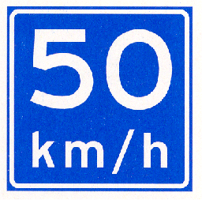
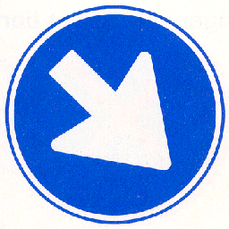
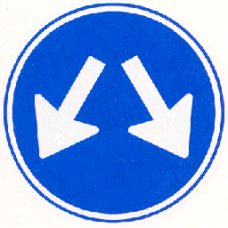
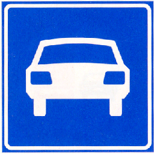

# Reglement verkeersregels en verkeerstekens 1990 (RVV 1990)

## Hoofdstuk I Begripsbepalingen

#### Artikel 1 RVV 1990 [Begripsbepaling]

In dit besluit en de daarop berustende bepalingen wordt verstaan onder:

- aanhangwagens: voertuigen die door een voertuig worden voortbewogen of kennelijk bestemd zijn om aldus te worden voortbewogen, alsmede opleggers;
- autobus: motorvoertuig, ingericht voor het vervoer van meer dan acht personen, de bestuurder daaronder niet begrepen;
- autosnelweg: weg, aangeduid door bord G1 van [bijlage I](#bijlage-1-rvv-1990-verkeersborden); langs autosnelwegen gelegen parkeerplaatsen, tankstations en bushalteplaatsen maken geen deel van de autosnelweg uit;
- autoweg: weg, aangeduid door bord G3 van [bijlage I](#bijlage-1-rvv-1990-verkeersborden); langs autowegen gelegen parkeerplaatsen, tankstations en bushalteplaatsen maken geen deel van de autoweg uit;
- bedrijfsauto: bedrijfsauto als bedoeld in artikel 1.1 van de Regeling voertuigen;
- bestelauto: motorvoertuig, bestemd voor het vervoer van goederen, waarvan de toegestane maximum massa niet meer bedraagt dan 3500 kg;
- bestemmingsverkeer: bestuurders wier reisdoel één of meer bepaalde percelen betreft die zijn gelegen aan of in de directe nabijheid van een weg met een door verkeerstekens aangegeven geslotenverklaring voor bepaalde categorieën bestuurders en die slechts via deze weg zijn te bereiken alsmede bestuurders van lijnbussen;
- bestuurders: alle weggebruikers behalve voetgangers;
- bestuurder van een motorvoertuig: hij die het motorvoertuig bestuurt;
- doorgaande rijbaan: rijbaan zonder de invoeg- en uitrijstroken;
- fietsstrook: door doorgetrokken of onderbroken strepen gemarkeerd gedeelte van de rijbaan waarop afbeeldingen van een fiets zijn aangebracht;
- geslotenverklaring: verbod de betrokken weg in te rijden of in te gaan alsmede de betrokken weg te gebruiken;
- haaientanden: voorrangsdriehoeken op het wegdek;
- kruispunt: kruising of splitsing van wegen;
- motorfiets: motorvoertuig op twee wielen al dan niet met zijspan- of aanhangwagen;
- personenauto: personenauto als bedoeld in artikel 1.1 van de Regeling voertuigen;
- rijbaan: elk voor rijdende voertuigen bestemd weggedeelte met uitzondering van de fietspaden en de fiets/bromfietspaden;
- rijstrook: door doorgetrokken of onderbroken strepen gemarkeerd gedeelte van de rijbaan van zodanige breedte dat bestuurders van motorvoertuigen op meer dan twee wielen daarvan gebruik kunnen maken;

## Hoofdstuk II Verkeersregels

#### Artikel 3 RVV 1990 [Rechts houden]

1. Bestuurders zijn verplicht zoveel mogelijk rechts te houden.
2. Fietsers mogen met zijn tweeën naast elkaar rijden. Dit geldt niet voor snorfietsers.

#### Artikel 4 RVV 1990 [Voetgangers]

1. Voetgangers gebruiken het trottoir of het voetpad.
2. Zij gebruiken het fietspad of het fiets/bromfietspad indien trottoir en voetpad ontbreken.
3. Zij gebruiken de berm of de uiterste zijde van de rijbaan, indien ook een fietspad of een fiets/bromfietspad ontbreekt.
4. In afwijking van het eerste en het tweede lid gebruiken personen die zich verplaatsen met behulp van voorwerpen, niet zijnde voertuigen, het fietspad, het fiets/bromfietspad, het trottoir of het voetpad. Zij gebruiken de rijbaan indien een fietspad, een fiets/bromfietspad, een trottoir of een voetpad ontbreekt.

#### Artikel 5 RVV 1990 [Fietsers]

1. Fietsers gebruiken het verplichte fietspad of het fiets/bromfietspad.
2. Zij gebruiken de rijbaan indien een verplicht fietspad of een fiets/bromfietspad ontbreekt.
3. Zij mogen het onverplichte fietspad gebruiken. Bestuurders van snorfietsen uitgerust met een verbrandingsmotor mogen het onverplichte fietspad slechts gebruiken met uitgeschakelde motor.
4. Bestuurders van fietsen op meer dan twee wielen die met inbegrip van de lading breder zijn dan 0,75 meter en van fietsen met aanhangwagen die met inbegrip van de lading breder zijn dan 0,75 meter mogen de rijbaan gebruiken.

#### Artikel 6 RVV 1990 [Bromfietsers]

1. Bromfietsers gebruiken het fiets/bromfietspad.
2. Zij gebruiken de rijbaan indien een fiets/bromfietspad ontbreekt.
3. Bestuurders van bromfietsen op meer dan twee wielen en bromfietsen met aanhangwagen, die met inbegrip van de lading breder zijn dan 0,75 meter, gebruiken de rijbaan.

#### Artikel 11 RVV 1990 [Wijze van inhalen]

1. Inhalen geschiedt links.
2. Bestuurders die links voorgesorteerd hebben en te kennen hebben gegeven dat zij naar links willen afslaan, worden rechts ingehaald.
3. Fietsers dienen elkaar links in te halen; zij mogen andere bestuurders rechts inhalen.
4. Bestuurders die zich rechts van een blokmarkering bevinden mogen bestuurders die zich links van deze markering bevinden rechts inhalen.
5. Bestuurders mogen trams rechts inhalen.

#### Artikel 12 RVV 1990 [Verbod inhalen voor voetgangersoversteekplaats]

Het is verboden een voertuig vlak voor of op een voetgangersoversteekplaats in te halen.

#### Artikel 13 RVV 1990 [Plaats op de weg bij fileverkeer]

1. Bij fileverkeer behoeft, indien de rijbaan is verdeeld in rijstroken in dezelfde richting, niet de meest rechts gelegen rijstrook te worden gevolgd.
2. Files mogen aan de rechterzijde worden ingehaald.

#### Artikel 14 RVV 1990 [Verbod blokkeren kruispunt]

Bestuurders mogen een kruispunt niet blokkeren.

#### Artikel 15 RVV 1990 [Voorrang]

1. Op kruispunten verlenen bestuurders voorrang aan voor hen van rechts komende bestuurders.
2. Op deze regel gelden de volgende uitzonderingen:
    1. bestuurders op een onverharde weg verlenen voorrang aan bestuurders op een verharde weg;
    2. bestuurders verlenen voorrang aan bestuurders van een tram.

#### Artikel 15a RVV 1990 [Gebruik overweg]

1. Weggebruikers mogen een overweg opgaan, indien zij direct kunnen doorgaan en de overweg geheel kunnen vrijmaken.
2. Bij overwegen laten weggebruikers een spoorvoertuig voorgaan en laten daarbij de overweg geheel vrij.

#### Artikel 16 RVV 1990 [Verbod doorsnijden militaire colonnes]

Weggebruikers mogen militaire colonnes en uitvaartstoeten van motorvoertuigen niet doorsnijden.

#### Artikel 17 RVV 1990 [Afslaan. Voorsorteren]

1. Bestuurders die willen afslaan, mogen voorsorteren door:
    1. indien zij naar rechts willen afslaan tijdig zoveel mogelijk aan de rechterzijde te gaan rijden;
    2. indien zij naar links willen afslaan tijdig zoveel mogelijk tegen de wegas te rijden of bij rijbanen bestemd voor bestuurders in één richting daarop zoveel mogelijk links te houden.
2. Bestuurders moeten alvorens af te slaan een teken met hun richtingaanwijzer of met hun arm geven.

#### Artikel 18 RVV 1990 [Voorrang bij afslaan]

1. Bestuurders die afslaan, moeten het verkeer dat hen op dezelfde weg tegemoet komt of dat op dezelfde weg zich naast dan wel links of rechts dicht achter hen bevindt, voor laten gaan.
2. Bestuurders die naar links afslaan, moeten tegemoetkomende bestuurders die op hetzelfde kruispunt naar rechts afslaan voor laten gaan.
3. Het eerste en het tweede lid gelden niet voor bestuurders van een tram.

#### Artikel 19 RVV 1990 [Snelheid in relatie tot remweg en zichtafstand]

De bestuurder moet in staat zijn zijn voertuig tot stilstand te brengen binnen de afstand waarover hij de weg kan overzien en waarover deze vrij is.

#### Artikel 20 RVV 1990 [Binnen bebouwde kom]

1. Binnen de bebouwde kom gelden de volgende maximumsnelheden:
    1. voor motorvoertuigen 80 km per uur;
    2. voor bromfietsen en gehandicaptenvoertuigen, uitgerust met een motor:
        1. op het fiets/bromfietspad 30 km per uur;
        2. op de rijbaan 45 km per uur;
        3. op het fietspad, voor de hier bedoelde gehandicaptenvoertuigen, 30 km per uur;
    3. voor gehandicaptenvoertuigen, uitgerust met een motor, en snorfietsen als bedoeld in artikel 1, eerste lid, onderdeel e, subonderdeel d, van de wet op het trottoir of het voetpad 10 km per uur.

#### Artikel 21 RVV 1990 [Buiten bebouwde kom]

1. Buiten de bebouwde kom gelden de volgende maximumsnelheden:
    1. voor motorvoertuigen op autosnelwegen 130 km per uur, op autowegen 100 km per uur en op andere wegen 80 km per uur;
    2. voor bromfietsen en gehandicaptenvoertuigen, uitgerust met een motor:
        1. op het fiets/bromfietspad 40 km per uur;
        2. op de rijbaan 45 km per uur;
        3. op het fietspad, voor de hier bedoelde gehandicaptenvoertuigen, 40 km per uur;
    3. voor gehandicaptenvoertuigen, uitgerust met een motor, en snorfietsen als bedoeld in artikel 1, eerste lid, onderdeel e, subonderdeel d, van de wet op het trottoir of het voetpad 10 km per uur.

#### Artikel 22 RVV 1990 [Bijzondere snelheidsmaxima]

1. Voor zover niet ingevolge andere artikelen van dit besluit een lagere maximumsnelheid geldt, gelden voor de volgende voertuigen de volgende bijzondere maximumsnelheden:
    1. voor kampeerwagens die volgens het kentekenbewijs behoren tot de categorie bedrijfsauto's en waarvan de toegestane maximummassa meer bedraagt dan 3500 kg, vrachtauto's en autobussen, niet zijnde T100-bussen, 80 km per uur;
    2. voor T100-bussen 100 km per uur;
    3. voor brommobielen 45 km per uur;
    4. voor snorfietsen 25 km per uur;
    5. voor personenauto's, bestelauto's, motorfietsen, driewielige motorvoertuigen en T100-bussen, die een aanhangwagen met een toegestane maximummassa van niet meer dan 3500 kg voortbewegen, 90 km per uur;
    6. voor andere dan de in onderdeel e genoemde motorvoertuigen met aanhangwagen 80 km per uur.

#### Artikel 23 RVV 1990 [Verbod stilstaan]

1. De bestuurder mag zijn voertuig niet laten stilstaan:
    1. op een kruispunt of een overweg;
    2. op een fietsstrook of op de rijbaan langs een fietsstrook;
    3. op een oversteekplaats of binnen een afstand van vijf meter daarvan;
    4. in een tunnel;
    5. bij een bord bushalte ter hoogte van de geblokte markering dan wel, ingeval die markering niet is aangebracht, op een afstand van minder dan 12 meter van het bord;
    6. op de rijbaan langs een busstrook en
    7. langs een gele doorgetrokken streep.
2. Onderdeel e van het eerste lid geldt niet voor het onmiddellijk laten in- en uitstappen van passagiers.

#### Artikel 24 RVV 1990 [Parkeerverboden]

1. De bestuurder mag zijn voertuig niet parkeren:
    1. bij een kruispunt op een afstand van minder dan vijf meter daarvan;
    2. voor een inrit of een uitrit;
    3. buiten de bebouwde kom op de rijbaan van een voorrangsweg;
    4. op een parkeergelegenheid:
        1. voor zover zijn voertuig niet behoort tot de op het bord of op het onderbord aangegeven voertuigcategorie of groep voertuigen;
        2. op een andere wijze of met een ander doel dan op het bord of op het onderbord is aangegeven;
        3. op dagen of uren waarop dit blijkens het onderbord is verboden;
    5. langs een gele onderbroken streep;
    6. op een gelegenheid bestemd voor het onmiddellijk laden en lossen van goederen;
    7. op een parkeerplaats voor vergunninghouders, aangeduid door verkeersbord E9 van bijlage I, indien voor zijn voertuig geen vergunning tot parkeren op die plaats is verleend.
2. Indien onder de verkeersborden E4 tot en met E8, E12 en E13 van bijlage 1, op een onderbord dagen of uren zijn vermeld, gelden de uit het bord of onderbord voortvloeiende geboden of verboden slechts gedurende de aangegeven dagen of uren.
3. De bestuurder mag zijn voertuig niet dubbel parkeren.
4. Indien een parkeergelegenheid, aangeduid met een van de verkeersborden E4 tot en met E10, E12 of E13 van bijlage 1, is voorzien van parkeervakken, mag slechts in die vakken worden geparkeerd.

#### Artikel 26 RVV 1990 [Parkeren op gehandicaptenparkeerplaats]

1. Op een gehandicaptenparkeerplaats mag slechts worden geparkeerd:
    1. een gehandicaptenvoertuig, indien het parkeren rechtstreeks verband houdt met het vervoer van een gehandicapte;
    2. een motorvoertuig op meer dan twee wielen waarin een geldige gehandicaptenparkeerkaart duidelijk zichtbaar is aangebracht, indien het parkeren rechtstreeks verband houdt met het vervoer van de gehandicapte aan wie de kaart is verstrekt, dan wel met het vervoer van een of meerdere personen die in een instelling verblijven, indien de kaart aan het bestuur van die instelling is verstrekt; of
    3. indien de gehandicaptenparkeerplaats is gereserveerd voor een bepaald voertuig, dat voertuig.

#### Artikel 27 RVV 1990 [Plaatsen fietsen en bromfietsen]

Fietsen en bromfietsen worden geplaatst op het trottoir, op het voetpad of in de berm dan wel op andere door het bevoegde gezag aangewezen plaatsen.

#### Artikel 28 RVV 1990 [Geven van signalen]

Bestuurders mogen slechts geluidssignalen en knippersignalen geven ter afwending van dreigend gevaar.

#### Artikel 32 RVV 1990 [Dimlicht bij dag en bij nacht]

1. Bestuurders van een motorvoertuig, een bromfiets, een snorfiets, een gehandicaptenvoertuig dat is uitgerust met een verbrandingsmotor, of een gehandicaptenvoertuig dat is uitgerust met een elektromotor en voorzien van een gesloten carrosserie, voeren bij dag, indien het zicht ernstig wordt belemmerd, en bij nacht dimlicht.
2. Het voeren van groot licht in plaats van dimlicht is toegestaan behoudens in de volgende gevallen:
    1. bij dag;
    2. bij het tegenkomen van een andere weggebruiker en
    3. bij het op korte afstand volgen van een ander voertuig.
3. Achterlicht en de verlichting van de achterkentekenplaat moeten steeds gelijktijdig met groot licht, dimlicht, stadslicht of mistlicht branden.

#### Artikel 35 RVV 1990 [Verlichting fietsers]

1. Fietsers voeren tijdens het rijden bij nacht of bij dag indien het zicht ernstig wordt belemmerd, verlichting overeenkomstig het tweede tot en met het vierde lid.
2. Een fiets op twee wielen en een fiets op drie wielen met één voorwiel moeten zijn voorzien van een wit of geel licht dat aan de voorzijde wordt gevoerd, tenzij de bestuurder een wit of geel licht voert op zijn borst.
3. Op een fiets op meer dan twee wielen met twee voorwielen moeten aan de voorzijde twee witte of twee gele symmetrisch links en rechts van het midden bevestigde lichten worden gevoerd.
4. Een fiets moet zijn voorzien van een rood achterlicht dat aan de achterzijde wordt gevoerd, tenzij de bestuurder of een achter de bestuurder gezeten passagier een rood licht voert op zijn rug.
5. Een fiets mag zijn voorzien van twee ambergeel licht stralende richtingaanwijzers aan de voorzijde en twee aan de achterzijde.
6. Er mogen niet meer lichten worden gevoerd op een fiets, door de bestuurder daarvan of door een achter de bestuurder gezeten passagier dan de in het tweede tot en met vijfde lid genoemde lichten.

#### Artikel 38 RVV 1990 [Stadslicht en achterlicht van motorvoertuigen]

Bestuurders van een motorvoertuig op meer dan twee wielen, die buiten de bebouwde kom stilstaan op de rijbaan en op langs autosnelwegen en autowegen gelegen parkeerstroken, parkeerhavens, vluchtstroken en vluchthavens moeten bij dag, indien het zicht ernstig wordt belemmerd, en bij nacht stadslicht en achterlicht voeren.

#### Artikel 42 RVV 1990 [Toegankelijkheid autosnelweg en autoweg]

1. Het gebruik van de autosnelweg is slechts toegestaan voor bestuurders van een motorvoertuig waarmee met een snelheid van ten minste 60 km per uur mag en kan worden gereden.
2. Het gebruik van de autoweg is slechts toegestaan voor bestuurders van een motorvoertuig waarmee met een snelheid van ten minste 50 km per uur mag en kan worden gereden.

#### Artikel 43 RVV 1990 [Gebruik van autosnelweg en autoweg]

1. Het is de bestuurders verboden op een autosnelweg of autoweg hun voertuig te keren of achteruit te rijden.
2. Het is de bestuurders voorts verboden op de rijbaan van een autosnelweg of autoweg hun voertuig te laten stilstaan.
3. Behoudens in noodgevallen is het de weggebruikers verboden op een autosnelweg of autoweg gebruik te maken van de vluchtstrook, de vluchthaven of de berm.
4. Op een autosnelweg is het bestuurders van een samenstel van voertuigen met een totale lengte van meer dan 7 meter en van een vrachtauto verboden op een rijbaan met drie of meer rijstroken enig andere dan de twee meest rechts gelegen rijstroken te gebruiken. Het verbod geldt niet voor het geval zij moeten voorsorteren.

#### Artikel 44 RVV 1990 [Gebruik van wegen binnen erven]

Voetgangers mogen wegen gelegen binnen een erf over de volle breedte gebruiken.

#### Artikel 45 RVV 1990 [Snelheid erven]

Bestuurders mogen binnen een erf niet sneller rijden dan 15 km per uur.

#### Artikel 50 RVV 1990 [Voorrangsvoertuig]

Weggebruikers moeten bestuurders van een voorrangsvoertuig voor laten gaan.

#### Artikel 54 RVV 1990 [Voorrang normale verkeer]

Bestuurders die een bijzondere manoeuvre uitvoeren, zoals wegrijden, achteruitrijden, uit een uitrit de weg oprijden, van een weg een inrit oprijden, keren, van de invoegstrook de doorgaande rijbaan oprijden, van de doorgaande rijbaan de uitrijstrook oprijden en van rijstrook wisselen, moeten het overige verkeer voor laten gaan.

#### Artikel 55 RVV 1990 [Gebruik richtingaanwijzer]

Bestuurders van een motorvoertuig respectievelijk bromfietsers moeten een teken met hun richtingaanwijzer geven respectievelijk een teken met hun richtingaanwijzer of met hun arm geven, indien zij willen wegrijden, andere bestuurders van een motorvoertuig willen inhalen, de doorgaande rijbaan willen oprijden en verlaten en indien zij van rijstrook willen wisselen alsmede bij alle andere belangrijke zijdelingse verplaatsingen.

#### Artikel 57 RVV 1990 [Onnodig geluid]

Bestuurders van een motorvoertuig, bromfietsers en snorfietsers mogen met hun voertuig geen onnodig geluid veroorzaken.

#### Artikel 60 RVV 1990 [Helmplicht]

De bestuurder en de passagiers van bromfietsen, snorfietsen, brommobielen zonder gesloten carrosserie, motorfietsen en driewielige motorvoertuigen zonder gesloten carrosserie moeten een goed passende helm dragen, die door middel van een sluiting op deugdelijke wijze op het hoofd is bevestigd.

#### Artikel 61a RVV 1990 [Verbod vasthouden mobiel elektronisch apparaat]

Het is degene die een voertuig bestuurt verboden tijdens het rijden een mobiel elektronisch apparaat dat gebruikt kan worden voor communicatie of informatieverwerking vast te houden. Onder een mobiel elektronisch apparaat wordt in elk geval verstaan een mobiele telefoon, een tabletcomputer of een mediaspeler.

## Hoofdstuk III Verkeerstekens

#### Artikel 62 RVV 1990 [Verkeerstekens inhoudende gebod of verbod]

Weggebruikers zijn verplicht gevolg te geven aan de verkeerstekens die een gebod of verbod inhouden.

#### Artikel 63 RVV 1990 [Rangorde tekens en regels]

Verkeerstekens gaan boven verkeersregels, voor zover deze regels onverenigbaar zijn met deze tekens.

#### Artikel 64 RVV 1990 [Rangorde verkeerslichten en tekens]

Verkeerslichten gaan boven verkeerstekens die de voorrang regelen.

#### Artikel 64a RVV 1990 [Elektronisch signaleringsbord]

Verkeersborden mogen op een elektronisch signaleringsbord worden weergegeven.

#### Artikel 68 RVV 1990 [Driekleurige verkeerslichten]

1. Bij driekleurige verkeerslichten betekent:
    1. groen licht: doorgaan;
    2. geel licht: stop; voor bestuurders die het teken zo dicht genaderd zijn dat stoppen redelijkerwijs niet meer mogelijk is: doorgaan;
    3. rood licht: stop.
2. Indien in een driekleurig verkeerslicht of in een daaraan toegevoegd éénkleurig verkeerslicht een verlichte pijl zichtbaar is, geldt het licht uitsluitend voor de door de pijl aangegeven richting.
3. Indien een verlichte afbeelding van een fiets zichtbaar is, geldt het licht voor fietsers, bromfietsers op een fiets/bromfietspad en bestuurders van een gehandicaptenvoertuig.

#### Artikel 69 RVV 1990 [Tweekleurige verkeerslichten]

1. Bij tweekleurige verkeerslichten betekent:
    1. geel licht: stop; voor bestuurders die het licht zo dicht genaderd zijn dat stoppen redelijkerwijs niet meer mogelijk is: doorgaan;
    2. rood licht: stop.
2. Het tweede tot en met derde lid van [artikel 68](#artikel-68-rvv-1990-driekleurige-verkeerslichten) zijn van overeenkomstige toepassing.

#### Artikel 76 RVV 1990 [Overschrijding doorgetrokken streep]

1. Een doorgetrokken streep die zich niet langs de rand van de rijbaanverharding bevindt, mag niet worden overschreden. Bestuurders mogen zich niet links van een doorgetrokken streep bevinden, indien die streep is aangebracht tussen rijstroken of paden met verkeer in beide richtingen.
2. Het eerste lid is niet van toepassing:
    1. indien de streep wordt overschreden om een naast de gevolgde rijstrook gelegen vluchthaven, vluchtstrook of spitsstrook te bereiken of te verlaten;
    2. indien aan de zijde vanwaar men de streep overschrijdt een onderbroken streep is aangebracht;
    3. op bestuurders die een fietsstrook mogen gebruiken, indien er tussen die fietsstrook en de ernaast gelegen rijstrook een doorgetrokken streep is aangebracht.

#### Artikel 77 RVV 1990 [Verdrijvingsvlakken]

1. Bestuurders mogen verdrijvingsvlakken en puntstukken niet gebruiken.
2. Het eerste lid is niet van toepassing wanneer bestuurders een spitsstrook volgen die een splitsing of samenvoeging van wegen, rijstroken of rijbanen passeert.
3. Het eerste lid is niet van toepassing wanneer bestuurders rechtmatig een busbaan of busstrook volgen die een splitsing of samenvoeging van wegen, rijstroken of rijbanen passeert.

#### Artikel 78 RVV 1990 [Voorsorteerstrook]

1. Bestuurders die de rijbaan volgen zijn verplicht op een kruispunt de richting te volgen die de voorsorteerstrook waarop zij zich bevinden aangeeft. Een in een voorsorteerstrook gelegen fietsstrook maakt deel uit van deze voorsorteerstrook.
2. Bestuurders die de doorgaande rijbaan verlaten en daartoe een uitrijstrook volgen, zijn ter hoogte van de daarin aangebrachte pijlen verplicht om de richting te volgen die de uitrijstrook waarop zij zich bevinden, aangeeft.

#### Artikel 79 RVV 1990 [Stopstreep]

Bestuurders moeten voor een voor hen bestemde stopstreep stoppen, indien stoppen op grond van dit besluit is verplicht.

#### Artikel 80 RVV 1990 [Haaientanden]

Haaientanden hebben de volgende betekenis: de bestuurders moeten voorrang verlenen aan bestuurders op de kruisende weg.

## Bijlage 1 RVV 1990 [Verkeersborden]

### Hoofdstuk A Snelheid

|                             |                                                      |     |
| --------------------------- | ---------------------------------------------------- | --- |
| Bord                        | Omschrijving                                         | A1  |
|  | Maximumsnelheid                                      |     |
| Bord                        | Omschrijving                                         | A2  |
|  | Einde maximumsnelheid                                |     |
| Bord                        | Omschrijving                                         | A3  |
|  | Maximumsnelheid op een electronisch signaleringsbord |     |
| Bord                        | Omschrijving                                         | A4  |
|  | Adviessnelheid                                       |     |
| Bord                        | Omschrijving                                         | A5  |
|  | Einde adviessnelheid                                 |     |

### Hoofdstuk B Voorrang

|                             |                                                            |     |
| --------------------------- | ---------------------------------------------------------- | --- |
| Bord                        | Omschrijving                                               | B1  |
|  | Voorrangsweg                                               |     |
| Bord                        | Omschrijving                                               | B2  |
|  | Einde voorrangsweg                                         |     |
| Bord                        | Omschrijving                                               | B6  |
|  | Verleen voorrang aan bestuurders op de kruisende weg       |     |
| Bord                        | Omschrijving                                               | B7  |
|  | Stop; verleen voorrang aan bestuurders op de kruisende weg |     |

### Hoofdstuk D Rijrichting

|                             |                                                                                        |     |
| --------------------------- | -------------------------------------------------------------------------------------- | --- |
| Bord                        | Omschrijving                                                                           | D1  |
|  | Rotonde; verplichte rijrichting                                                        |     |
| Bord                        | Omschrijving                                                                           | D2  |
|  | Gebod voor alle bestuurders het bord voorbij te gaan aan de zijde die de pijl aangeeft |     |
| Bord                        | Omschrijving                                                                           | D3  |
|  | Bord mag aan beide zijden worden voorbijgegaan                                         |     |

### Hoofdstuk E Parkeren en stilstaan

|                             |                      |     |
| --------------------------- | -------------------- | --- |
| Bord                        | Omschrijving         | E1  |
|  | Parkeerverbod        |     |
| Bord                        | Omschrijving         | E2  |
|  | Verbod stil te staan |     |

### Hoofdstuk G Verkeersregels

|                             |                   |     |
| --------------------------- | ----------------- | --- |
| Bord                        | Omschrijving      | G1  |
|  | Autosnelweg       |     |
| Bord                        | Omschrijving      | G2  |
|  | Einde Autosnelweg |     |
| Bord                        | Omschrijving      | G3  |
|  | Autoweg           |     |
| Bord                        | Omschrijving      | G4  |
|  | Einde autoweg     |     |

### Hoofdstuk H Bebouwde kom

|                             |                    |     |
| --------------------------- | ------------------ | --- |
| Bord                        | Omschrijving       | H1  |
|  | Bebouwde kom       |     |
| Bord                        | Omschrijving       | H1  |
|  | Einde bebouwde kom |     |
